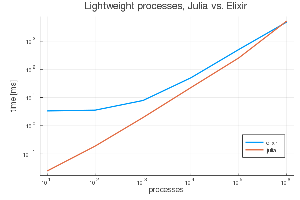

# Lightweight tasks, Julia vs Elixir

**note:** there is a thread on this on [Julia Discourse](https://discourse.julialang.org/t/lightweight-tasks-julia-vs-elixir-otp/35082) as well.

I wanted to know if Julia copes well with very lightweight tasks. Therefore I took [an example](https://media.pragprog.com/titles/elixir16/code/spawn/chain.exs) from [Programming Elixir 1.6](https://pragprog.com/book/elixir16/programming-elixir-1-6) and implemented it in Julia:

```julia
function counter(next::Channel{Int})
    return ch -> put!(next, take!(ch)+1)
end

function create_processes(start::Channel{Int}, n::Int; spawn=false)
    next = start
    for i in 1:n
        next = Channel{Int}(counter(next), spawn=spawn)
    end

    put!(next, 0)

    take!(start)
end
```

then

```julia
julia> using BenchmarkTools

julia> @btime create_processes(start, 10, spawn=true)
  24.595 μs (318 allocations: 17.84 KiB)
10
```

The result were as follows:



Julia scales better than Elixir probably since no start time is involved.
